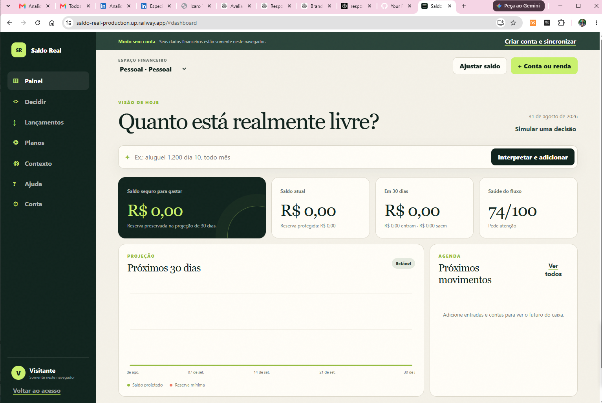
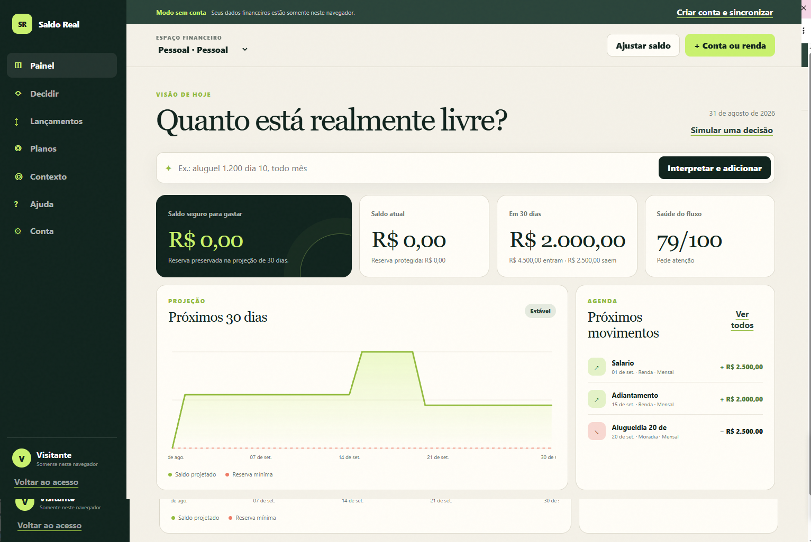
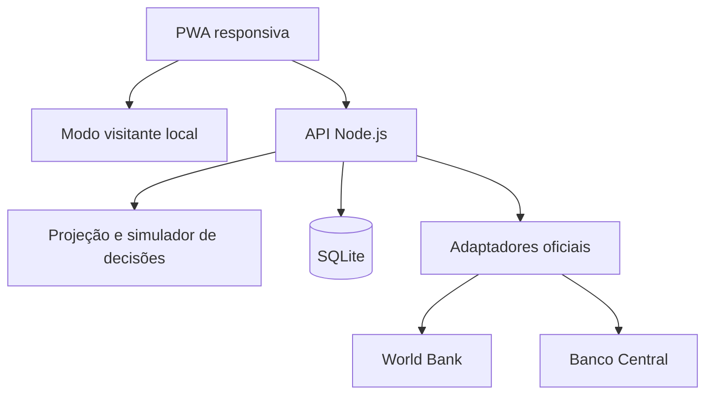

# Saldo Real

> **Quanto está realmente livre hoje?** Uma PWA de previsibilidade financeira que transforma saldo, contas, renda variável, dívidas e metas em uma projeção simples para os próximos 7 e 30 dias.

[](https://github.com/Sembla/saldo-real/actions/workflows/ci.yml)
[](https://nodejs.org/)
[](LICENSE)

**Beta online:** [saldo-real-production.up.railway.app](https://saldo-real-production.up.railway.app)

> Use dados fictícios durante a validação inicial. A versão beta ainda não possui recuperação de senha por e-mail nem confirmação de endereço.

## Evidência funcional

A aplicação está publicada no Railway e pode ser utilizada diretamente no navegador. As capturas abaixo registram dois estados do mesmo fluxo: o painel inicial sem movimentações e o painel após a inclusão de receitas e despesas fictícias, com atualização da projeção, agenda e indicador de saúde do fluxo.

### 1. Estado inicial



### 2. Projeção após lançamentos



No segundo estado, o dashboard reflete **R$ 4.500,00 em entradas**, **R$ 2.500,00 em saídas** e **R$ 2.000,00 projetados em 30 dias**, além de atualizar o gráfico e os próximos movimentos. Os valores são dados fictícios usados exclusivamente para demonstração.

**O que esta evidência demonstra:** interface executável em ambiente público, entrada de movimentações, processamento das regras de projeção e atualização do estado financeiro apresentado ao usuário.

## Por que este produto existe

Muitos aplicativos mostram o que já aconteceu. O **Saldo Real** trabalha na dor que vem antes da decisão: “posso gastar isso sem faltar para as contas?”. Ele calcula o menor saldo projetado, preserva uma reserva definida pelo usuário e reduz entradas variáveis pela probabilidade de recebimento — sem suavizar despesas.

O problema é relevante no Brasil e fora dele. Pesquisas de endividamento, inadimplência, inclusão e alfabetização financeira mostram que acesso a uma conta não significa previsibilidade de caixa. As referências utilizadas na descoberta estão documentadas em [docs/DATA_SOURCES.md](docs/DATA_SOURCES.md).

## O que já funciona

- Cadastro, login e logout com sessões seguras.
- **Experimentar sem conta:** saldo, lançamentos, planos e simulações ficam somente no navegador até o usuário decidir criar uma conta.
- Backup local em JSON e migração explícita dos dados do visitante para uma conta nova.
- Central de ajuda dentro do aplicativo e manual completo de 10 páginas, organizado em trilhas para usuários iniciantes e experientes.
- Troca autenticada de senha com encerramento das outras sessões.
- Exportação integral dos dados da conta em JSON.
- Exclusão definitiva da conta e dos dados associados.
- Espaços separados para finanças pessoais e do negócio.
- Saldo atual e reserva mínima protegida.
- Entradas e saídas avulsas, semanais, mensais ou anuais.
- Ajuste de renda variável por nível de confiança.
- Entrada rápida em português, como `aluguel R$ 1.200 dia 10 todo mês`.
- Projeções de 7 e 30 dias com data de risco e valor seguro para gastar.
- **Decisão Segura:** compara pagar agora, esperar ou parcelar e explica o impacto de cada caminho no caixa e na reserva.
- Indicador educativo de saúde do fluxo.
- Cadastro de dívidas, metas e atualização visual do progresso.
- Contexto por país com World Bank Indicators e Selic pelo Banco Central do Brasil.
- Catálogo rastreável de fontes oficiais globais e brasileiras.
- PWA responsiva e instalável, sem biblioteca de interface externa.
- Banco SQLite, cache de integrações, auditoria e API JSON.
- Testes de domínio, autenticação, isolamento e jornada de API.

## Demonstração local

Pré-requisito: **Node.js 24.15 ou superior**. O projeto não exige `npm install` porque usa apenas módulos nativos.

```bash
git clone https://github.com/Sembla/saldo-real.git
cd saldo-real
cp .env.example .env
node scripts/seed.mjs
node src/server.js
```

Abra `http://localhost:3000`. A carga de demonstração cria, somente no ambiente local:

```text
demo@saldo.real
SaldoReal2026
```

Também é possível criar uma conta nova pela interface.

### Docker

```bash
docker compose up --build
```

O banco fica no volume `saldo-real-data`.

## Arquitetura



A escolha por Node.js nativo + SQLite deixa o MVP fácil de executar, auditar e demonstrar. No modo visitante, os dados financeiros permanecem no armazenamento local do navegador; apenas fontes econômicas públicas são consultadas pela rede. Consulte [Arquitetura](docs/ARCHITECTURE.md) e [decisões de segurança](docs/SECURITY.md).

## Como o cálculo funciona

1. O saldo atual é o ponto de partida.
2. Cada despesa entra com 100% do valor.
3. Uma renda variável de R$ 1.000 com confiança de 70% adiciona R$ 700 à projeção conservadora.
4. O motor percorre cada dia e encontra o menor saldo do período.
5. `saldo seguro = máximo(0, menor saldo projetado − reserva mínima)`.
6. Se o saldo ficar negativo, a primeira data é apresentada como risco crítico; se apenas tocar a reserva, vira atenção.
7. O simulador aplica uma decisão hipotética ao mesmo fluxo e compara compra imediata, data desejada e parcelamento, sem movimentar dinheiro.

Valores monetários são armazenados em centavos inteiros para evitar erros de ponto flutuante.

## Comandos

| Comando | Uso |
|---|---|
| `node src/server.js` | Inicia a aplicação |
| `node --watch src/server.js` | Desenvolvimento com recarga |
| `node scripts/seed.mjs` | Cria dados de demonstração |
| `node --test` | Executa a suíte de testes |
| `node scripts/check.mjs` | Valida sintaxe e arquivos essenciais |
| `node --test --experimental-test-coverage` | Gera relatório de cobertura |
| `python3 scripts/generate-user-guide.py` | Regenera o manual visual em PDF |

Os atalhos equivalentes também estão em `package.json` para ambientes em que o `npm` já esteja disponível.

## Configuração

| Variável | Padrão | Descrição |
|---|---:|---|
| `PORT` | `3000` | Porta HTTP |
| `HOST` | `127.0.0.1` | Interface de rede |
| `DATABASE_PATH` | `./data/saldo-real.db` | Arquivo SQLite |
| `APP_ORIGIN` | `http://localhost:3000` | Origem aceita em operações de escrita |
| `SESSION_TTL_HOURS` | `168` | Validade da sessão |
| `COOKIE_SECURE` | `false` | Exige HTTPS no cookie; use `true` em produção |
| `OUTBOUND_DATA_ENABLED` | `true` | Permite consultas às fontes oficiais |

## Estrutura

```text
public/                 PWA, design system e service worker
src/domain/             regras puras de projeção e saúde financeira
src/db/                 schema, migrações e repositório
src/security/           senha, token e cookie
src/data/               adaptadores e catálogo de fontes oficiais
src/app.js              rotas, validação e composição do produto
test/                   testes unitários e de integração
docs/                   produto, arquitetura, API, dados e segurança
```

## Limites responsáveis

Este projeto é um **MVP funcional**, não um banco, corretora ou consultoria. Ele não movimenta dinheiro, não recomenda ativos, não negocia dívidas e não importa dados bancários. O contexto econômico ajuda na educação e não altera automaticamente decisões do usuário. Open Finance, notificações e motores preditivos ficam para fases posteriores, após validação de uso e revisão regulatória.

## Roadmap e contribuição

O plano de evolução está em [docs/ROADMAP.md](docs/ROADMAP.md). Issues pequenas e reproduzíveis são bem-vindas. Antes de enviar uma mudança:

```bash
node scripts/check.mjs
node --test
```

## Autor

**Henrique Sembla** — projeto de portfólio em engenharia de IA, automação de processos, backend e produto orientado por dados.

Licença [MIT](LICENSE).
