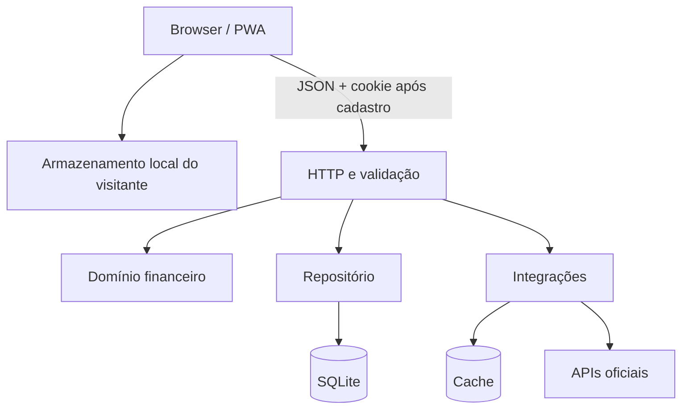
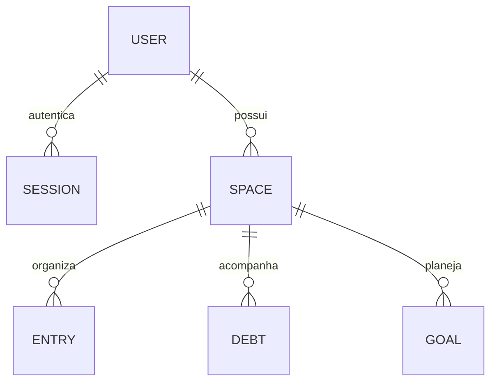

# Arquitetura

## Visão

O Saldo Real é um monólito modular para o estágio de validação. Interface, API e motor financeiro ficam no mesmo deploy, mas as regras de domínio, persistência, segurança e integrações têm fronteiras explícitas.

## Módulos

| Área | Responsabilidade |
|---|---|
| `public/` | Interface, PWA e modo visitante com cálculo e persistência locais |
| `src/domain/` | Projeção, recorrência, indicador educativo e simulação de decisões; funções puras e testáveis |
| `src/db/` | Migrações idempotentes, acesso parametrizado e isolamento por proprietário |
| `src/security/` | Hash de senha, token de sessão e cookies |
| `src/data/` | Fontes oficiais, busca, normalização, timeout e cache |
| `src/app.js` | Rotas HTTP, validação, autorização e composição dos casos de uso |

## Modelo de dados

Todos os valores monetários usam centavos inteiros. Datas financeiras usam `AAAA-MM-DD`; timestamps de auditoria usam ISO 8601 UTC.

## Decisões

### Node.js nativo

O runtime oferece HTTP, criptografia, testes, `fetch` e SQLite. Não depender de pacotes reduz o tempo de instalação e a superfície de supply chain para o MVP. O requisito mínimo é Node.js 24.15.

### SQLite

É suficiente para a primeira fase, facilita demo e backup e preserva transações e integridade referencial. Para escala horizontal, o contrato do repositório permite migrar para PostgreSQL sem alterar as regras do domínio.

### Monólito modular

Separar serviços agora adicionaria latência operacional sem validar a dor. A separação futura deve acontecer apenas quando volume, equipes ou requisitos de disponibilidade justificarem.

### Adaptadores oficiais

“Global” não significa coletar toda a internet. Significa um catálogo versionado de fontes oficiais, com adaptadores específicos, cache e origem exposta ao usuário.

### Simulações sem persistência

Uma decisão hipotética é calculada no domínio e não altera lançamentos, saldo ou metas. O usuário só persiste algo quando escolhe transformar a simulação em plano. Isso permite explorar caminhos sem contaminar os dados reais.

### Local-first antes do cadastro

O visitante pode usar as funções centrais sem identidade. Espaços, lançamentos, dívidas e metas ficam em `localStorage`, e projeções e simulações são executadas no navegador. A exportação gera um JSON local. Somente após consentimento explícito, uma conta recém-criada importa o backup em transação e substitui os identificadores locais por identificadores do servidor.

## Evolução esperada

1. PostgreSQL e migrações versionadas quando houver múltiplas instâncias.
2. Fila para sincronizações e notificações.
3. Observabilidade com métricas, traces e logs estruturados.
4. Cofre de segredos e serviço de identidade gerenciado.
5. Open Finance apenas com consentimento granular, criptografia e revisão regulatória.
